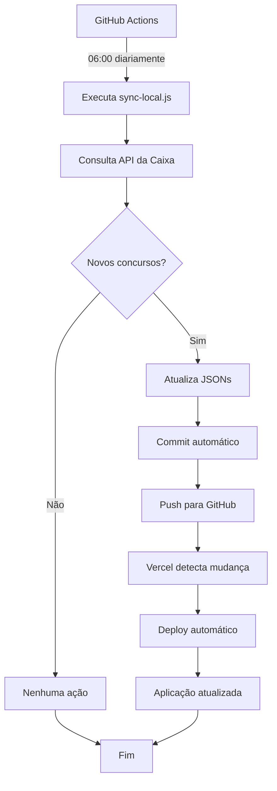

# 🚀 Deploy na Vercel com Sincronização Automática

Este documento explica como o sistema funciona quando deployado na Vercel com sincronização automática via GitHub Actions.

## 🎯 Como Funciona

### **Fluxo Completo:**



### **Componentes:**

1. **🤖 GitHub Actions** - Executa sincronização na nuvem
2. **📁 Arquivos JSON** - Banco de dados versionado no Git
3. **🚀 Vercel** - Hospedagem e deploy automático
4. **🎰 Aplicação** - Usa JSONs como fonte de dados

## ⚙️ Configuração

### **1. GitHub Actions (Já configurado)**

O arquivo `.github/workflows/sync-lottery.yml` está configurado para:

- ✅ Executar diariamente às 06:00 UTC (03:00 Brasília)
- ✅ Buscar novos concursos da API da Caixa
- ✅ Atualizar arquivos JSON se houver novos dados
- ✅ Fazer commit e push automático
- ✅ Gerar relatório de execução

### **2. Vercel (Configuração necessária)**

Configure o deploy automático na Vercel:

```bash
# 1. Conecte seu repositório GitHub à Vercel
# 2. Configure as variáveis de ambiente (se necessário)
# 3. Ative deploy automático no branch main
```

**Configurações recomendadas:**

- **Framework**: Vite
- **Build Command**: `npm run build`
- **Output Directory**: `dist`
- **Install Command**: `npm install`

### **3. Variáveis de Ambiente (Opcional)**

Se precisar de configurações específicas:

```env
# vercel.json ou dashboard da Vercel
NODE_ENV=production
VITE_API_BASE_URL=https://seu-dominio.vercel.app
```

## 📊 Monitoramento

### **GitHub Actions**

Monitore as execuções em:

- `https://github.com/seu-usuario/seu-repo/actions`

**Logs disponíveis:**

- ✅ Status da sincronização
- 📊 Quantidade de novos concursos
- ⏱️ Tempo de execução
- 🚨 Erros (se houver)

### **Vercel Deployments**

Monitore os deploys em:

- `https://vercel.com/seu-usuario/seu-projeto/deployments`

**Informações disponíveis:**

- 🚀 Status do deploy
- ⏱️ Tempo de build
- 📝 Logs de build
- 🌐 URL de preview

### **Status da Aplicação**

Acesse `/status.html` para ver:

- 📊 Total de concursos por loteria
- 🕐 Última atualização
- ✅ Status de cada banco de dados
- 📈 Estatísticas gerais

## 🔄 Fluxo de Dados

### **Desenvolvimento Local**

```bash
# 1. Desenvolver localmente
npm run dev

# 2. Testar sincronização
npm run sync

# 3. Commit e push
git add .
git commit -m "feat: nova funcionalidade"
git push origin main

# 4. Vercel faz deploy automático
```

### **Produção (Automático)**

```bash
# 1. GitHub Actions executa diariamente
06:00 UTC → sync-lottery.yml

# 2. Se há novos dados
Commit automático → Push → Deploy Vercel

# 3. Aplicação sempre atualizada
Usuários veem dados mais recentes
```

## 🛠️ Comandos Úteis

### **Execução Manual do GitHub Actions**

```bash
# Via interface web do GitHub
1. Vá para Actions → Sync Lottery Data
2. Clique em "Run workflow"
3. Selecione branch main
4. Clique "Run workflow"
```

### **Verificar Status**

```bash
# Localmente
npm run sync

# Status da aplicação
curl https://seu-dominio.vercel.app/api/simple-status

# Arquivos JSON
curl https://seu-dominio.vercel.app/data/lotofacil.json
curl https://seu-dominio.vercel.app/data/megasena.json
```

### **Deploy Manual na Vercel**

```bash
# Instalar Vercel CLI
npm i -g vercel

# Deploy
vercel --prod
```

## 🚨 Solução de Problemas

### **GitHub Actions não está executando**

**Possíveis causas:**

- Repositório inativo por muito tempo
- Workflow desabilitado
- Erro de permissões

**Soluções:**

```bash
# 1. Verificar se workflow está ativo
GitHub → Actions → Workflows → Sync Lottery Data

# 2. Executar manualmente uma vez
Actions → Run workflow

# 3. Verificar permissões
Settings → Actions → General → Workflow permissions
```

### **Vercel não está fazendo deploy**

**Possíveis causas:**

- Deploy automático desabilitado
- Branch incorreto configurado
- Erro de build

**Soluções:**

```bash
# 1. Verificar configuração
Vercel Dashboard → Project → Settings → Git

# 2. Verificar logs de build
Vercel Dashboard → Deployments → Ver logs

# 3. Deploy manual
vercel --prod
```

### **Dados não estão atualizando**

**Possíveis causas:**

- GitHub Actions falhou
- API da Caixa fora do ar
- Erro no script de sincronização

**Soluções:**

```bash
# 1. Verificar logs do GitHub Actions
Actions → Última execução → Ver logs

# 2. Executar sincronização manual
npm run sync

# 3. Verificar API da Caixa
curl https://servicebus2.caixa.gov.br/portaldeloterias/api/lotofacil
```

## 📈 Performance

### **Métricas Esperadas**

- **Sincronização**: 30-60 segundos
- **Build Vercel**: 1-2 minutos
- **Deploy total**: 2-3 minutos
- **Frequência**: 1x por dia (06:00 UTC)

### **Otimizações**

- ✅ Cache de dependências no GitHub Actions
- ✅ Build incremental na Vercel
- ✅ Sincronização apenas de novos dados
- ✅ Commit apenas quando há mudanças

## 🎯 Próximos Passos

### **Melhorias Planejadas**

1. **Notificações**: Webhook para Discord/Slack quando há novos concursos
2. **Backup**: Backup automático dos dados em cloud storage
3. **Analytics**: Métricas de uso da aplicação
4. **Multi-região**: Deploy em múltiplas regiões

### **Monitoramento Avançado**

1. **Uptime**: Monitorar disponibilidade da aplicação
2. **Performance**: Métricas de carregamento
3. **Erros**: Alertas automáticos para falhas
4. **Uso**: Analytics de usuários

---

## ✅ Checklist de Deploy

- [ ] Repositório conectado à Vercel
- [ ] GitHub Actions configurado e ativo
- [ ] Primeiro deploy manual realizado
- [ ] Status page funcionando (`/status.html`)
- [ ] Dados carregando corretamente
- [ ] Geração de jogos funcionando
- [ ] Execução manual do workflow testada

**🎉 Pronto! Seu sistema está 100% automatizado na nuvem!**
